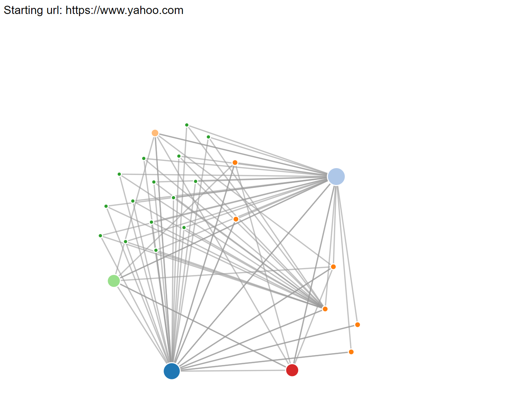
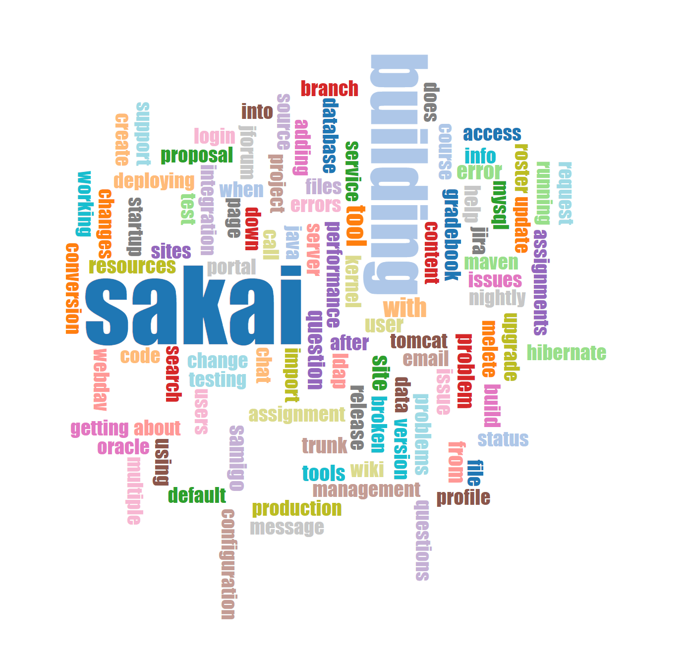
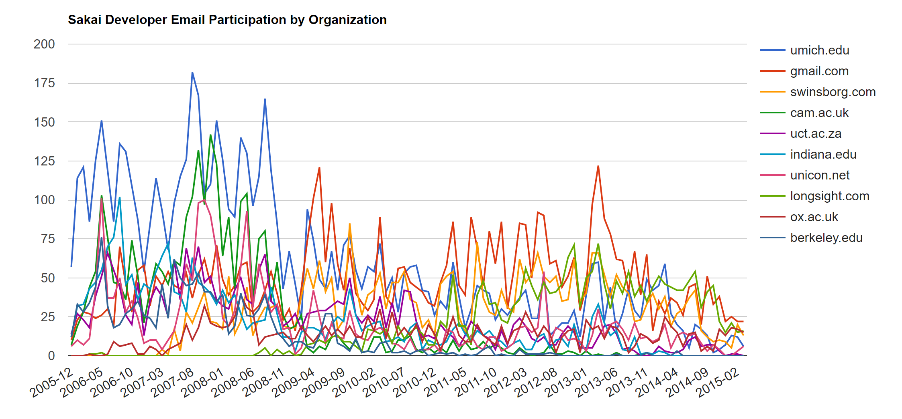

# py4e-Capstone

## Building a Search Engine - Introduction
This week we will download and run a simple version of the Google PageRank Algorithm.  Here is an early paper by Larry Page and Sergy Brin, the founders of Google, that describes their early thoughts about the algorithm:

http://infolab.stanford.edu/~backrub/google.html

We will provide you with sample code and lectures that walk through the sample code:

https://www.py4e.com/code3/pagerank.zip

There is not a lot of new code to write - it is mostly looking at the code and making the code work.  You will be able to spider some simple content that we provide and then play with the program to spider some other content.  Part of the fun of this assignment is when things go wrong and you figure out how to solve a problem when the program wanders into some data that breaks its retrieval and parsing.  So you will get used to starting over with a fresh database and running your web crawl.

## Spidering and Modeling Email Data - Introduction
This week we do the first half of a project to download, process, and visualize an email corpus from the Sakai open source project from 2004-2011:

http://mbox.dr-chuck.net/

This is a large amount of data and requires significant cleanup to make sense of the data before we visualize it.

Important: You do not have to download all of the data to complete this project.  Depending on your Internet connection, downloading nearly a gigabyte of data might be impossible.  All we want to do is to have you download a small subset of the data and run the steps to process the data.  

Here is the software we will be using to retrieve and process the email data:

https://www.py4e.com/code3/gmane.zip

If you have a fast network connection with no bandwidth charge - you can download all the data.   If you try to download all the data it may take well over 24 hours to pull the data.  The good news is that because there are separate crawl, clean, model, and visualization steps, you can start and stop the crawl process as often as you like and run the other processes on the data that has been downloaded so far.

## Visualizing Email Data
This week we visualize our retrieved mail data.    We will do a word cloud visualization.   While a word cloud might seem a little silly and over-used, it is actually a very engaging way to visualize a frequency distribution or histogram.   The word cloud is really a nice continuation of frequency/counting assignments we have been doing throughout this specialization.

The second visualization will be to show how the data is changing over time.   Since not all students will download all of the data, we must be remember that not all the visualizations will look the same when we are peer-grading other student submissions.

This is also a good time to remember to remind those with slow network connections or those who have connections that are charged for bandwidth that they should avoid attempting to download all 1GB of the mail data before they attempt their visualization.

